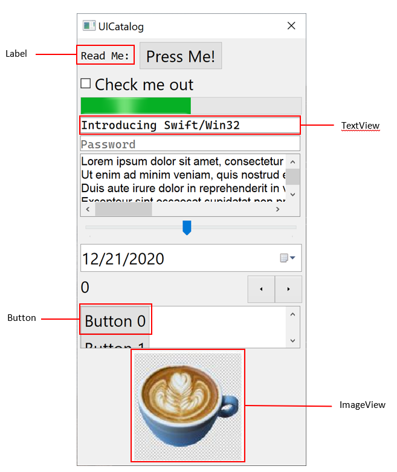

## Views and controls

Swift-Win32 provides visual components such as labels and buttons.

The visual component library API is inspired by [UIKit](https://developer.apple.com/documentation/uikit/views_and_controls) but their actual implementation is provided by [Windows Common Controls](https://docs.microsoft.com/en-us/windows/win32/controls/common-control-window-classes). For example: the `Label` has a similar API than UIKit's `UILabel` and is drawn using the `WC_STATIC` win32 control called.

The root class for all views is the `View` class. Some views which are designed for user interactions (such as button) inherit from the `Control` class (which in turn inherits the `View` class).

### Views and controls catalog

| Control      | win32 control      | Description                                              |
| ------------ | ------------------ | -------------------------------------------------------- |
| Label        | WC_STATIC          | A view that displays text                                |
| TextView     | MSFTEDIT_CLASS     | A view that shows scrollable lines of text               |
| ImageView    | WC_STATIC          | A view that display and image                            |
| ProgressView | PROGRESS_CLASS     | A view that renders a progress bar                       |
| Button       | WC_BUTTON          | A control that executes code in response to clicks       |
| DatePicker   | DATETIMEPICK_CLASS | A control that lets the user choose a date               |
| TableView    | WC_LISTBOX         | A view that shows a list of items                        |
| TextField    | MSFTEDIT_CLASS     | A control that lets the user enter text                  |
| Slider       | TRACKBAR_CLASS     | A control that permits to selects a value in a range     |
| Stepper      | UPDOWN_CLASS       | A control that allows to increment and decrement a value |
| Swicth       | WC_BUTTON          | A control that offers two choices                        |
