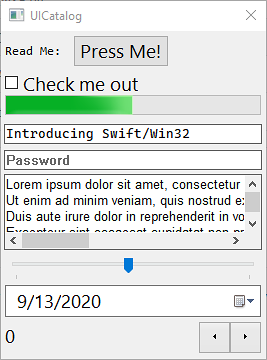

# Swift/Win32



Swift/Win32 aims to provide a [MVC](https://en.wikipedia.org/wiki/Model%E2%80%93view%E2%80%93controller) model for writing applications on Windows.  It provides Swift friendly wrapping of the Win32 APIs much like [MFC](https://en.wikipedia.org/wiki/Microsoft_Foundation_Class_Library) did for C++.

## Build Requirements

- Swift 5.3 or newer
- Windows SDK 10.0.107763 or newer
- CMake 3.16 or newer

## Building

This requires the 5.3 or newer. You can use the the release binaries from [swift.org](https://swift.org/download/) or download the nightly build from [Azure](https://dev.azure.com/compnerd/swift-build).

The following example session shows how to build with CMake 3.16 or newer.

```cmd
set SWIFTFLAGS=-sdk %SDKROOT% -resource-dir %SDKROOT%/usr/lib/swift -I %SDKROOT%/usr/lib/swift -L %SDKROOT%/usr/lib/swift/windows

cmake -B build -D BUILD_SHARED_LIBS=YES -D CMAKE_BUILD_TYPE=Release -D CMAKE_Swift_FLAGS="%SWIFTFLAGS%" -G Ninja -S .
ninja -C build SwiftWin32 UICatalog

%CD%\build\bin\UICatalog.exe
```
