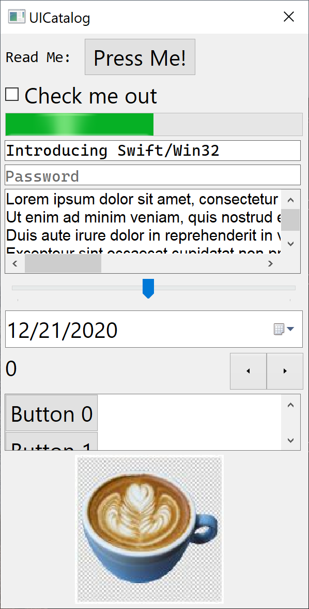

---
# Feel free to add content and custom Front Matter to this file.
# To modify the layout, see https://jekyllrb.com/docs/themes/#overriding-theme-defaults

layout: home
---

Swift/Win32 aims to provide a [MVC](https://en.wikipedia.org/wiki/Model%E2%80%93view%E2%80%93controller) model for writing applications on Windows.  It provides Swift friendly wrapping of the Win32 APIs much like [MFC](https://en.wikipedia.org/wiki/Microsoft_Foundation_Class_Library) did for C++.

  

